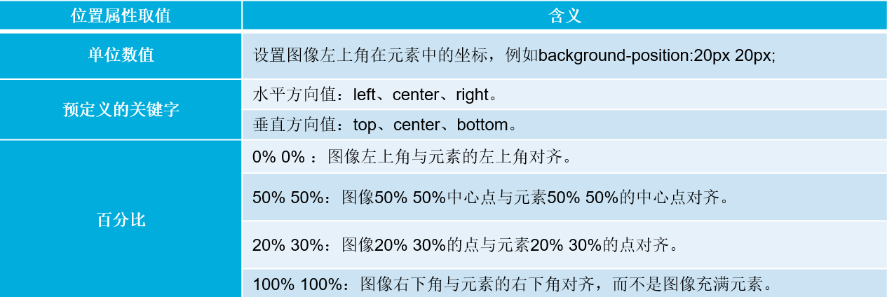
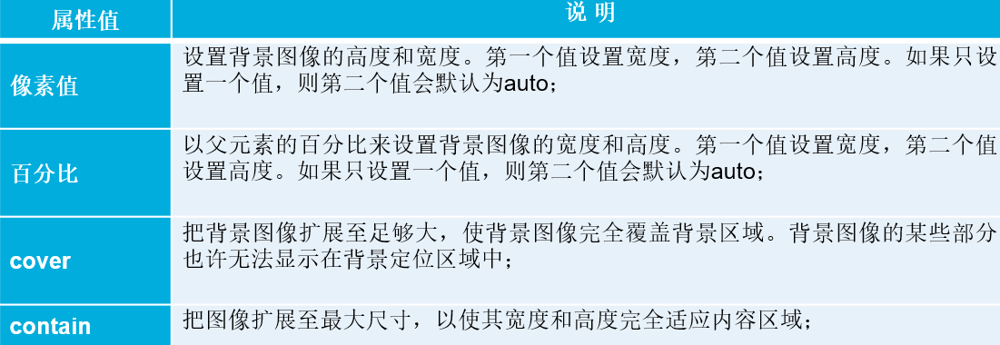

# 背景设置

## 设置背景颜色与图像

在CSS中，网页元素的背景颜色使用background-color属性来设置

在CSS中，还可以将图像作为网页元素的背景，通过background-image属性实现。


## 背景与图片不透明度的设置

通过引入RGBA模式和opacity属性，可以设置图片的不透明度。

rgba(r,g,b,alpha);

opacity：opacityValue;

opacity属性用于定义元素的不透明度，参数opacityValue表示不透明度的值，它是一个介于0~1之间的浮点数值。其中，0表示完全透明，1表示完全不透明，而0.5则表示半透明。


## 设置背景图像的平铺与位置

默认情况下，背景图像会自动向水平和竖直两个方向平铺。如果不希望背景图像平铺，或者只沿着一个方向平铺，可以通过background-repeat属性来控制。

**background-repeat图像平铺属性**


**background-position图像位置属性**




## 设置背景图像固定方式与大小

background-attachment图像固定属性


运用CSS3中的background-size属性可以轻松控制背景图像的大小。

background-size:属性值1 属性值2;




## 设置背景图像的显示区域与裁剪区域

运用CSS3中的background-origin属性可以自行定义背景图像的相对位置。

background-origin:属性值;

在上面的语法格式中，background-origin属性有三种取值，分别表示不同的含义，具体解释如下。

padding-box：背景图像相对于内边距区域来定位。

border-box：背景图像相对于边框来定位。

content-box：背景图像相对于内容框来定位。


在CSS样式中，background-clip属性用于定义背景图像的裁剪区域

在语法格式上，background-clip属性和background-origin 属性的取值相似，但含义不同，具体解释如下。

border-box：默认值，从边框区域向外裁剪背景。

padding-box：从内边距区域向外裁剪背景。

content-box：从内容区域向外裁剪背景。


## 设置多重背景图像

在CSS3中，通过background-image、background-repeat、background-position和background-size等属性提供多个属性值可以实现多重背景图像效果，各属性值之间用逗号隔开。


## 背景复合属性

CSS中的背景属性也是一个复合属性，可以将背景相关的样式都综合定义在一个复合属性background中。

```
background:
[background-color] 
[background-image] 
[background-repeat] 
[background-attachment] 
[background-position] 
[background-size] 
[background-clip] 
[background-origin];
```


## 线性渐变

在线性渐变过程中，起始颜色会沿着一条直线按顺序过渡到结束颜色。运用CSS3中的 “background-image:linear-gradient（参数值）;”样式可以实现线性渐变效果。

linear-gradient用于定义渐变方式为线性渐变，括号内用于设定渐变角度和颜色值。

•渐变角度指水平线和渐变线之间的夹角，可以是以deg为单位的角度数值或关键词。

•颜色值用于设置渐变颜色，其中“颜色值1”表示起始颜色，“颜色值n”表示结束颜色，起始颜色和结束颜色之间可以添加多个颜色值，各颜色值之间用“,”隔开。

```
background-image:linear-gradient(渐变角度,颜色值1,颜色值2...,颜色值n);
```


## 径向渐变

径向渐变是网页中另一种常用的渐变，在径向渐变过程中，起始颜色会从一个中心点开始，依据椭圆或圆形形状进行扩张渐变。运用CSS3中的“background-image:radial-gradient（参数值）;”样式可以实现径向渐变效果

```
background-image:radial-gradient(渐变形状 圆心位置,颜色值1,颜色值2...,颜色值n);

```

radial-gradient用于定义渐变的方式为径向渐变，括号内的参数值用于设定渐变形状、圆心位置和颜色值。

•渐变形状用来定义径向渐变的形状，其取值即可以是定义水平和垂直半径的像素值或百分比，也可以是相应的关键词。

•圆心位置用于确定元素渐变的中心位置，使用“at”加上关键词或参数值来定义径向渐变的中心位置。

•“颜色值1”表示起始颜色，“颜色值n”表示结束颜色，起始颜色和结束颜色之间可以添加多个颜色值，各颜色值之间用“,”隔开。


## 重复渐变

在网页设计中，经常会遇到在一个背景上重复应用渐变模式的情况，这时就需要使用重复渐变。

**重复线性渐变**

在CSS3中，通过“background-image:repeating-linear-gradient（参数值）;”样式可以实现重复线性渐变的效果

```
background-image:repeating-linear-gradient(渐变角度,颜色值1,颜色值2...,颜色值n);
```

**重复径向渐变**

在CSS3中，通过“background-image:repeating-radial-gradient（参数值）;”样式可以实现重复线性渐变的效果

```
background-image:repeating-radial-gradient(渐变形状 圆心位置,颜色值1,颜色值2...,颜色值n);
```


## 阶段案例
