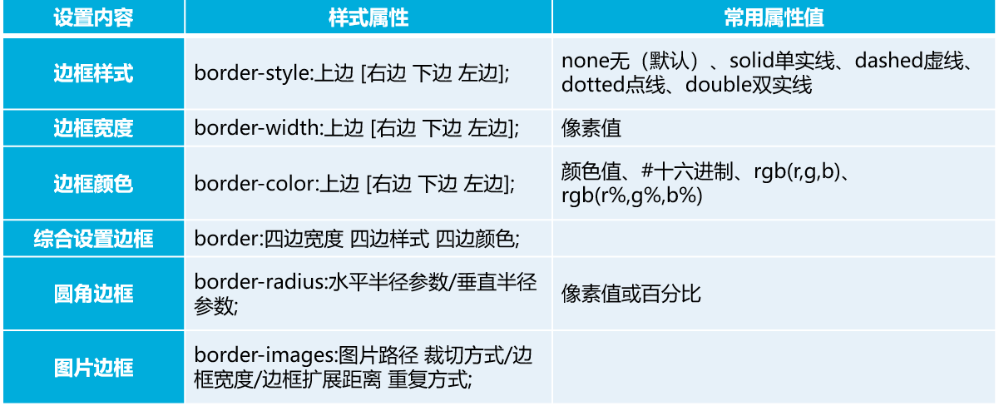

# CSS 盒子模型

## 认识盒子模型

**盒子模型**是网页布局的基础，只有掌握了盒子模型的各种规律和特征，才可以更好地控制网页中**各个元素**所呈现的效果。

所谓的盒子模型在HTML中就是一个盛装 元素内容的容器。

每个盒子模型都由元素的内容、内边距 （padding）、边框（border）和外边距（margin）组成。


## div 标记

<div>标记是一个块容器标记。


可以将网页分割为独立的部分，以实现网页的规划和布局。

大多数HTML标记都可以嵌套在<div>标记中，<div>中还可以嵌套多层<div>。

可以替代大多数的块级文本标记。


## 盒子的宽和高

盒子的总宽度= width+左右内边距之和+左右边框宽度之和+左右外边距之和

盒子的总高度= height+上下内边距之和+上下边框宽度之和+上下外边距之和





## 边框属性


## 边距属性

注意：内边距padding不允许使用负值

注意：和内边距不同，外边距margin允许使用负值

当对**块级元素**应用宽度属性**width**，并将左右的外边距都设置为**auto**，可使**块级元素水平居中**，实际工作中常用这种方式进行网页布局。

为了更方便地控制网页中的元素，制作网页时，通常先清除元素的默认内外边距。


## box-shadow 属性

CSS3中的box-shadow属性可以轻松实现阴影的添加，其基本语法格式如下：

```
box-shadow:像素值1 像素值2 像素值3 像素值4 颜色值 阴影类型;
```


box-shadow属性也可以改变阴影的投射方向以及添加多重阴影效果。


## box-sizing 属性

box-sizing属性用于定义盒子的宽度值和高度值是否包含元素的内边距和边框，其基本语法格式如下:

```
box-sizing: content-box/border-box;
```

content-box：浏览器对盒模型的解释遵从W3C 标准，当定义width和height时，它的参数值不包括border和padding。

border-box：当定义width和height时，border和padding的参数值被包含在width和height之内。


