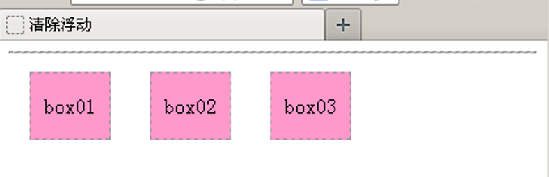

# 浮动与定位

在默认情况下，网页中的元素会按照从上到下或从左到右的顺序一 一罗列。如果仅仅按照这种默认的方式进行布局，网页将会显得单调、混乱。为了使网页的布局更加丰富、合理，可以在CSS中对元素设置浮动和定位属性。

初学者在设计一个页面时，通常会按照默认的排版方式，将页面中的元素从上到下一 一罗列


## 元素的浮动属性float

所谓元素的浮动是指设置了浮动属性的元素会脱离标准文档流的控制，移动到其父元素中指定位置的过程。

**基本语法格式**

```
选择器{float:属性值;}
```


## 清除浮动

由于浮动元素不再占用原文档流中的位置，所以会对页面中其他元素的排版产生影响，如果要避免这种影响，就需要对元素清除浮动。

**运用****clear****属性清除浮动**

```
选择器{clear:属性值;}
```

**属性**          **描述**

**left**      不允许左侧有浮动元素（清除左侧浮动的影响）

**right**      不允许右侧有浮动元素（清除右侧浮动的影响）

**both**      同时清除左右两侧浮动的影响


运用clear属性只能清除元素左右两侧浮动的影响。然而在制作网页时，经常会遇到一些特殊的浮动影响。




**空标记**

在浮动元素之后添加空标记，并对该标记应用“clear:both”样式，可清除浮动。这个空标记可以为<div>、<p>、<hr />等任何标记。

**overflow**

“overflow:hidden;”样式，也可以清除浮动对该元素的影响，该方法弥补了空标记清除浮动的不足。

**after伪对象**

使用after伪对象也可以清除浮动，但是该方法只适用于IE8及以上版本浏览器和其他非IE浏览器。


## overflow 属性


overflow属性可以解决**溢出**问题，其基本语法格式如下：

```
选择器{overflow:属性值;}

```


overflow属性的常用值有四个，具体如下表所示。

**属性值**      **描述**

**visible**      内容不会被修剪，会呈现在元素框之外（默认值）

**hidden**      溢出内容会被修剪，并且被修剪的内容是不可见的

**auto**      在需要时产生滚动条，即自适应所要显示的内容

**scroll**      溢出内容会被修剪，且浏览器会始终显示滚动条


## 元素的定位属性

浮动布局虽然灵活，但是却无法对元素的位置进行精确的控制。在CSS中，通过定位属性可以实现网页中元素的精确定位。

在CSS中，通过CSS定位（CSS position）可以实现网页元素的精确定位。元素的定位属性主要包括定位模式和边偏移两部分。

position属性用于定义元素的定位模式，其基本语法格式如下：

```
选择器{position:属性值；}

```

position属性的常用值有四个，具体如下表所示

**属性值**    **描述**

**static**      自动定位（默认定位方式）

**relative**      相对定位，相对于其原文档流的位置进行定位

**absolute**      绝对定位，相对于其上一个已经定位的父元素进行定位

**fixed**      固定定位，相对于浏览器窗口进行定位


通过边**偏移属性**top、bottom、left或right，来精确定义定位元素的位置，其取值为不同单位的数值或百分比，如下表所示。

**边偏移属性**      **描述**

**top**      顶端偏移量，定义元素相对于其父元素上边线的距离

**bottom**      底部偏移量，定义元素相对于其父元素下边线的距离

**left**      左侧偏移量，定义元素相对于其父元素左边线的距离

**right**      右侧偏移量，定义元素相对于其父元素右边线的距离


## 静态定位

静态定位是元素的默认定位方式，当position属性的取值为static时，可以将元素定位于静态位置。 所谓静态位置就是各个元素在HTML文档流中默认的位置。任何元素在默认状态下都会以静态定位来确定自己的位置，所以当没有定义position属性时，并不说明该元素没有自己的位置，它会遵循默认值显示为静态位置。在静态定位状态下，无法通过边偏移属性（top、bottom、left或right）来改变元素的位置。


## 相对定位 relative

相对定位是将元素相对于它在标准文档流中的位置进行定位。


在文档流中的位置仍然保留着


## 绝对定位 absolute

绝对定位是将元素依据最近的已经定位（绝对、固定或相对定位）的父元素进行定位，若所有父元素都没有定位，则依据body根元素（浏览器窗口）进行定位。


## 静态定位 与固定定位

固定定位是绝对定位的一种特殊形式，它以浏览器窗口作为参照物来定义网页元素。当position属性的取值为fixed时，即可将元素的定位模式设置为固定定位。


## z-index 层叠等级属性


## 元素的类型

HTML标记被定义成了不同的类型，一般分为块标记和行内标记，也称块元素和行内元素。


**块元素**

在页面中以区域块的形式出现。

每个块元素通常都会独自占据一整行或多整行。

可以对其设置宽度、高度、对齐等属性。


**行内元素**

不占有独立的区域。

仅仅靠自身的字体大小和图像尺寸来支撑结构。

一般不可以设置宽度、高度、对齐等属性


**常见的块元素**

```html
<h1>---<h6>
<div>
<p>
<ol>  <ul>
<li>
```


**常见的行内元素**

```html
<strong></strong>
<a></a>
<b></b>
<u></u>
<em></em>
<i></i>
<span></span>
```


## span 标记

<span>标记是一个行内标记。

<span>与</span>之间只能包含文本和各种行内标记。

<span>标记常用于定义网页中某些特殊显示的文本，配合class属性使用。

当其他行内标记都不合适时，就可以使用<span>标记。


## 元素的转换

**display 属性**

**属性值**       **描述**

**inline**        此元素将显示为行内元素（行内元素默认的display属性值）

**block**         此元素将显示为块元素（块元素默认的display属性值）

**inline-block**      此元素将显示为行内块元素，可以对其设置宽高和对齐等属性，但是该元素不会独占一行

**none**         此元素将被隐藏，不显示，也不占用页面空间


## 阶段案例

