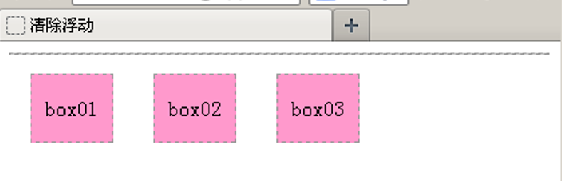

# 浮动

在默认情况下，网页中的元素会按照从上到下或从左到右的顺序一 一罗列。如果仅仅按照这种默认的方式进行布局，网页将会显得单调、混乱。为了使网页的布局更加丰富、合理，可以在CSS中对元素设置浮动和定位属性。

初学者在设计一个页面时，通常会按照默认的排版方式，将页面中的元素从上到下一 一罗列

**文档流**
文档流，是指盒子按照html标签编写的顺序依次从上到下，从左到右排列，块元素占一行，行内元素在一行之内从左到右排列，先写的先排列，后写的排在后面，每个盒子都占据自己的位置。

**浮动特性**

1、浮动元素有左浮动(float:left)和右浮动(float:right)两种

2、浮动的元素会向左或向右浮动，碰到父元素边界、浮动元素、未浮动的元素才停下来

3、相邻浮动的块元素可以并在一行，超出父级宽度就换行

4、浮动让行内元素或块元素自动转化为行内块元素

5、浮动元素后面没有浮动的元素会占据浮动元素的位置，没有浮动的元素内的文字会避开浮动的元素，形成文字饶图的效果

6、父元素内整体浮动的元素无法撑开父元素，需要清除浮动

7、浮动元素之间没有垂直margin的合并


## 元素的浮动属性float

所谓元素的浮动是指设置了浮动属性的元素会脱离标准文档流的控制，移动到其父元素中指定位置的过程。

**基本语法格式**

```
选择器{float:属性值;}
```


## 清除浮动

由于浮动元素不再占用原文档流中的位置，所以会对页面中其他元素的排版产生影响，如果要避免这种影响，就需要对元素清除浮动。

运用**clear**属性清除浮动

```
选择器{clear:属性值;}
```

**属性**          **描述**

**left**      不允许左侧有浮动元素（清除左侧浮动的影响）

**right**      不允许右侧有浮动元素（清除右侧浮动的影响）

**both**      同时清除左右两侧浮动的影响


**清除浮动**

- 父级上增加属性overflow：hidden

- 在最后一个子元素的后面加一个空的div，给它样式属性 clear:both（不推荐）

- 使用成熟的清浮动样式类，clearfix

  ```html
  .clearfix:after,.clearfix:before{ content: "";display: table;}
  .clearfix:after{ clear:both;}
  .clearfix{zoom:1;}
  ```

  清除浮动的使用方法：

  ```html
  .con2{... overflow:hidden}
  或者
  <div class="con2 clearfix">
  ```


运用clear属性只能清除元素左右两侧浮动的影响。然而在制作网页时，经常会遇到一些特殊的浮动影响。




**空标记**

在浮动元素之后添加空标记，并对该标记应用“clear:both”样式，可清除浮动。这个空标记可以为<div>、<p>、<hr />等任何标记。

**overflow**

“overflow:hidden;”样式，也可以清除浮动对该元素的影响，该方法弥补了空标记清除浮动的不足。

**after伪对象**

使用after伪对象也可以清除浮动，但是该方法只适用于IE8及以上版本浏览器和其他非IE浏览器。


## 

