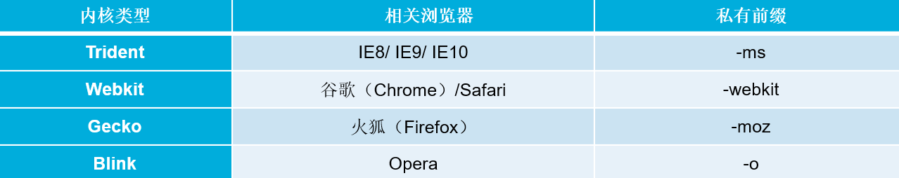

# CSS 3 入门

## CSS 3 简介

随着网页制作技术的不断发展，陈旧的CSS特性和标准已经无法满足现今的交互设计需求，开发者往往需要更多的字体选择、更方便的样式效果、更绚丽的图形动画。CSS3的出现，在不需要改变原有设计结构的情况下，增加了许多新特性，极大地满足了开发者的需求。

如果希望网页美观、大方，并且升级轻松、维护方便，就需要使用CSS，实现结构与表现的分离。

由于各浏览器厂商对CSS3各属性的支持程度不一样，因此在标准尚未明确的情况下，会用厂商的前缀加以区分，通常把这些加上私有前缀的属性称之为“私有属性”。各主流浏览器都定义了自己的私有属性，以便让用户更好的体验CSS的新特性。




运用CSS3私有属性时，要遵从一定的书写顺序，即先写私有的CSS3属性，再写标准的CSS3属性。

当一个CSS3属性成为标准属性，并且被主流浏览器的最新版普遍兼容的时候，就可以省略私有的CSS3属性。


## CSS 样式规则

> 选择器{属性1:属性值1; 属性2:属性值2; 属性3:属性值3;}

CSS样式中的选择器严格区分大小写，属性和值不区分大小写，按照书写习惯一般将“选择器、属性和值”都采用小写的方式。

多个属性之间必须用英文状态下的分号隔开，最后一个属性后的分号可以省略，但是为了便于增加新样式最好保留。

如果属性的值由多个单词组成且中间包含空格，则必须为这个属性值加上英文状态下的引号。

在编写CSS代码时，为了提高代码的可读性，通常会加上CSS注释。

在CSS代码中空格是不被解析的，花括号以及分号前后的空格可有可无。


## 引入CSS 样式表

行内式也称为内联样式，是通过标记的style属性来设置元素的样式。

内嵌式是将CSS代码集中写在HTML文档的<head>头部标记中，并且用<style>标记定义。

链入式是将所有的样式放在一个或多个以.css为扩展名的外部样式表文件中，通过<link />标记将外部样式表文件链接到HTML文档中。

1、外部样式：通过link标签，链接到外部样式表到页面中。

```
<link rel="stylesheet" type="text/css" href="css/main.css">
```

2、内部样式：通过style标签，在网页上创建嵌入的样式表。

```
<style type="text/css">
    div{ width:100px; height:100px; color:red }
    ......
</style>
```

3、行内样式：通过标签的style属性，在标签上直接写样式。

```
<div style="width:100px; height:100px; color:red ">......</div>
```


## css好处

内容与表现分离；

网页的表现统一，容易修改；

丰富的样式，使页面布局更加灵活；

减少网页的代码量，增加网页的浏览速度，节省网络带宽；

运用独立于网页的CSS，有利于网页被搜索引擎收录；


## CSS样式优先级

行内样式>内部样式>内联样式

Id选择器>类选择器>标签选择器


## 标记选择器

要想将CSS样式应用于特定的HTML元素，首先需要找到该目标元素。在CSS中，执行这一任务的样式规则部分被称为选择器。

标记选择器是指用HTML标记名称作为选择器，按标记名称分类，为页面中某一类标记指定统一的CSS样式。

```
标记名{属性1:属性值1; 属性2:属性值2; 属性3:属性值3; }

        /*标签选择器*/

        p{
            font-size:30px;
            color:red;
        }
```


## 类选择器

类选择器使用“.”（英文点号）进行标识，后面紧跟类名。

```
.类名{属性1:属性值1; 属性2:属性值2; 属性3:属性值3; }

        /*类选择器*/

        .classValue{
            font-size: 50px;
            color: blue;
        }
```


## id 选择器

id选择器使用“#”进行标识，后面紧跟id名，其基本语法格式如下：

```
#id名{属性1:属性值1; 属性2:属性值2; 属性3:属性值3; }

    /*    id选择器*/
        #idNo{
            font-size: 60px;
            color: blueviolet;
        }
```


## 通配符选择器

通配符选择器用“*”号表示，它是所有选择器中作用范围最广的，能匹配页面中所有的元素。

```
*{属性1:属性值1; 属性2:属性值2; 属性3:属性值3; }
```


## 层级选择器

主要应用在选择父元素下的子元素，或者子元素下面的子元素，可与标签元素结合使用，减少命名，同时也可以通过层级，防止命名冲突。
举例：

```html
.box span{color:red}
.box .red{color:pink}
.red{color:red}

<div class="box">
    <span>....</span>
    <a href="#" class="red">....</a>
</div>

<h3 class="red">....</h3>
```


## 组选择器

多个选择器，如果有同样的样式设置，可以使用组选择器。
举例：

```html
.box1,.box2,.box3{width:100px;height:100px}
.box1{background:red}
.box2{background:pink}
.box2{background:gold}

<div class="box1">....</div>
<div class="box2">....</div>
<div class="box3">....</div>
```


## 伪类及伪元素选择器

常用的伪类选择器有hover，表示鼠标悬浮在元素上时的状态，伪元素选择器有before和after,它们可以通过样式在元素中插入内容。

```html
.box1:hover{color:red}
.box2:before{content:'行首文字';}
.box3:after{content:'行尾文字';}


<div class="box1">....</div>
<div class="box2">....</div>
<div class="box3">....</div>
```

另外还要超链接伪类，分为：鼠标未访问、鼠标悬浮其上、鼠标按住不放、鼠标已访问过四种情况，代码如下

```html
a:link{color:red;}
a:hover{color:yellow;}
a:active{color:green;}
a:visited{color:blue;}
```


## 标签指定式选择器

标签指定式选择器又称交集选择器，由两个选择器构成，其中第一个为标记选择器，第二个为class选择器或id选择器，两个选择器之间不能有空格，如h3.special或p#one。


## 后代选择器

后代选择器用来选择元素或元素组的后代，其写法就是把外层标记写在前面，内层标记写在后面，中间用空格分隔。当标记发生嵌套时，内层标记就成为外层标记的后代。


## 并集选择器

并集选择器是各个选择器通过逗号连接而成的，任何形式的选择器都可以作为并集选择器的一部分。若某些选择器定义的样式完全或部分相同，可利用并集选择器为它们定义相同的样式。


## 字体样式属性

**font-size属性用于设置字号**

font-size属性用于设置字号，该属性的值可以使用相对长度单位，也可以使用绝对长度单位

**font-family属性用于设置字体**

font-family属性用于设置字体。网页中常用的字体有宋体、微软雅黑、黑体等。

**font-weight属性用于定义字体的粗细。**

font-weight属性用于定义字体的粗细。

**font-style属性用于定义字体风格。**

font-style属性用于定义字体风格，如设置斜体、倾斜或正常字体。

**font属性用于对字体样式进行综合设置**

```
选择器{font: font-style font-variant font-weight font-size/line-height font-family;}
```

**@font-face属性用于定义服务器字体**

通过@font-face属性，开发者可以在用户计算机未安装字体时，使用任何喜欢的字体。

```
@font-face{
         font-family:字体名称;
         src:字体路径;
     }
```

**word-wrap属性用于长单词和URL地址的自动换行**

当word-wrap属性值为break-word时，URL地址会沿边框自动换行。


## 文本外观属性

**color**

**color**属性用于定义文本的颜色，其取值方式有如下3种：

```
预定义的颜色值，如red，green，blue等。

十六进制，如#FF0000，#FF6600，#29D794等。实际工作中，十六进制是最常用的定义颜色的方式。

RGB代码，如红色可以表示为rgb(255,0,0)或rgb(100%,0%,0%)。

```


**letter-spacing**

**letter-spacing****属性**用于定义字间距，所谓字间距就是字符与字符之间的空白

```
letter-spacing属性，其属性值可为不同单位的数值，允许使用负值，默认为normal
```


**word-spacing ** 

**word-spacing****属性**用于定义英文单词之间的间距，对中文字符无效

```
word-spacing属性用于定义英文单词之间的间距，和letter-spacing一样，其属性值可为不同单位的数值，允许使用负值，默认为normal。

```


**line-height ** 

**line-height****属性**用于设置行间距，所谓行间距就是行与行之间的距离，即字符的垂直间距，一般称为行高。

```
line-height常用的属性值单位有三种，分别为像素px，相对值em和百分比%，实际工作中使用最多的是像素px。

```


**text-align**  

用于设置文本内容水平对齐，相当于html中的align对齐属性

```
其可用属性值如下：
left：左对齐（默认值）
right：右对齐。
center：居中对齐。

```


**text-transform**  

用于控制英文字符的大小写。

```
其可用属性值如下：
none：不转换（默认值）。
capitalize：首字母大写。
uppercase：全部字符转换为大写。
lowercase：全部字符转换为小写。

```


**text-decoration**

用于设置文本的下划线，上划线，删除线等装饰效果

```
其可用属性值如下：
none：没有装饰（正常文本默认值）。
underline：下划线。
overline：上划线。
line-through：删除线。

```


**text-indent**

用于设置首行文本的缩进

```
其属性值可为不同单位的数值、em字符宽度的倍数、或相对于浏览器窗口宽度的百分比%，允许使用负值, 建议使用em作为设置单位。
```


**white-space**

设置空白符的处理方式

```
其属性值如下：
normal：常规（默认值），文本中的空格、空行无效，满行（到达区域边界）后自动换行。
pre：预格式化，按文档的书写格式保留空格、空行原样显示。
nowrap：空格空行无效，强制文本不能换行，除非遇到换行标记<br />。内容超出元素的边界也不换行，若超出浏览器页面则会自动增加滚动条。

```


**text-shadow**

使用text-shadow属性可以为页面中的文本添加阴影效果。

```
选择器{	text-shadow:h-shadow v-shadow blur color;}
```


**text-overflow**

text-overflow属性用于标示对象内溢出的文本。

```
text-overflow属性的常用取值有两个：
clip：修剪溢出文本，不显示省略标记“…”。
ellipsis：用省略标记“…”标示被修剪文本，省略标记插入的位置是最后一个字符。

```


## CSS 层叠性和继承性

层叠性是指多种CSS样式的叠加。


继承性是指书写CSS样式表时，子标记会继承父标记的某些样式，如文本颜色和字号。

**并不是所有的CSS属性都可以继承，例如，下面的属性就不具有继承性：**

**边框属性**

**定位属性**

**内/外边距属性**

**布局属性**

**背景属性**

**元素宽高属性**


## CSS 优先级

定义CSS样式时，经常出现两个或更多规则应用在同一元素上，这时就会出现优先级的问题。

```
<p class="father" id="header" >
	<strong class="blue">文本的颜色</strong>
</p>

```

```
p strong{ color:black}                                     /*权重为:1+1*/
strong.blue{ color:green;}                              /*权重为:1+10*/
.father strong{ color:yellow}                           /*权重为:10+1*/
p.father strong{ color:orange;}                       /*权重为:1+10+1*/
p.father .blue{ color:gold;}                             /*权重为:1+10+10*/ 
#header strong{ color:pink;}                          /*权重为:100+1*/ 
#header strong.blue{ color:red;}                    /*权重为:100+1+10*/

```

在考虑权重时，初学者还需要注意一些特殊的情况

```
继承样式的权重为0。
行内样式优先。
权重相同时，CSS遵循就近原则。
CSS定义了一个!important命令，该命令被赋予最大的优先级。

```

复合选择器的权重为组成它的基础选择器权重的叠加，但是这种叠加并不是简单的数字之和


## 阶段案例

