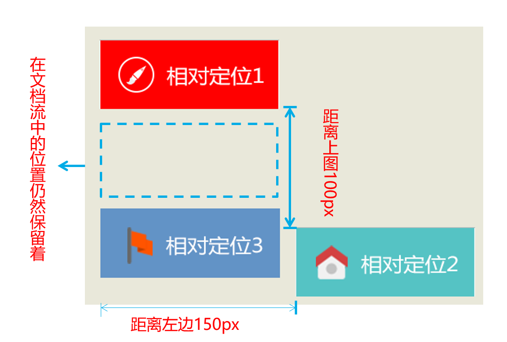
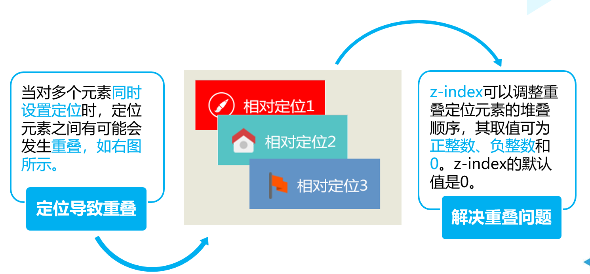

# 定位

浮动布局虽然灵活，但是却无法对元素的位置进行精确的控制。在CSS中，通过定位属性可以实现网页中元素的精确定位。

在CSS中，通过CSS定位（CSS position）可以实现网页元素的精确定位。元素的定位属性主要包括定位模式和边偏移两部分。

position属性用于定义元素的定位模式，其基本语法格式如下：

```
选择器{position:属性值；}

```

position属性的常用值有四个，具体如下表所示

**属性值**    **描述**

**static**      自动定位（默认定位方式）

**relative**      相对定位，相对于其原文档流的位置进行定位

**absolute**      绝对定位，相对于其上一个已经定位的父元素进行定位

**fixed**      固定定位，相对于浏览器窗口进行定位


通过边**偏移属性**top、bottom、left或right，来精确定义定位元素的位置，其取值为不同单位的数值或百分比，如下表所示。

**边偏移属性**      **描述**

**top**      顶端偏移量，定义元素相对于其父元素上边线的距离

**bottom**      底部偏移量，定义元素相对于其父元素下边线的距离

**left**      左侧偏移量，定义元素相对于其父元素左边线的距离

**right**      右侧偏移量，定义元素相对于其父元素右边线的距离


## 静态定位

静态定位是元素的默认定位方式，当position属性的取值为static时，可以将元素定位于静态位置。 所谓静态位置就是各个元素在HTML文档流中默认的位置。任何元素在默认状态下都会以静态定位来确定自己的位置，所以当没有定义position属性时，并不说明该元素没有自己的位置，它会遵循默认值显示为静态位置。在静态定位状态下，无法通过边偏移属性（top、bottom、left或right）来改变元素的位置。


## 相对定位 relative

相对定位是将元素相对于它在标准文档流中的位置进行定位。


在文档流中的位置仍然保留着




## 绝对定位 absolute

绝对定位是将元素依据最近的已经定位（绝对、固定或相对定位）的父元素进行定位，若所有父元素都没有定位，则依据body根元素（浏览器窗口）进行定位。


## 静态定位 与固定定位

固定定位是绝对定位的一种特殊形式，它以浏览器窗口作为参照物来定义网页元素。当position属性的取值为fixed时，即可将元素的定位模式设置为固定定位。


## z-index 层叠等级属性




