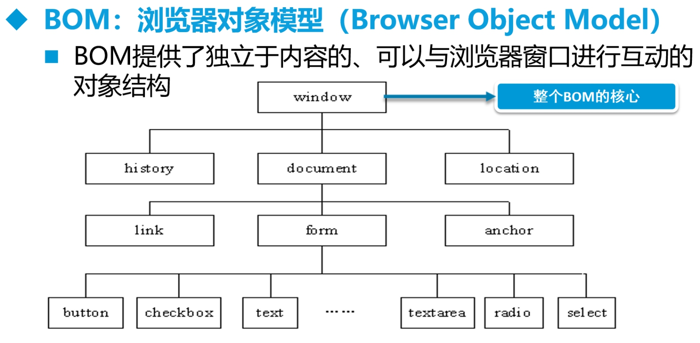
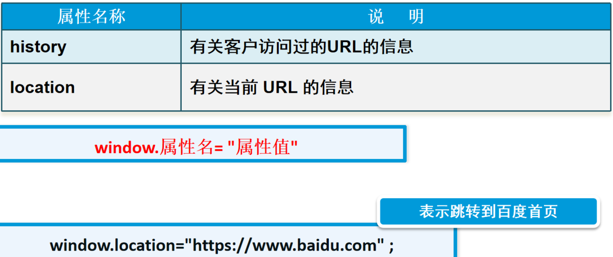
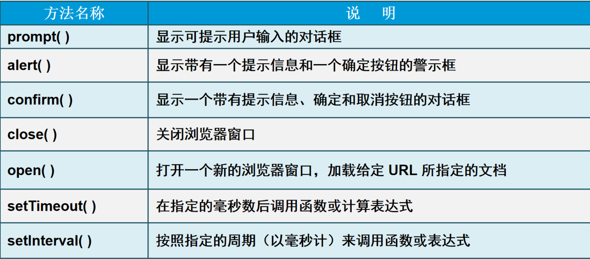

# DOM和BOM模型

JavaScript组成

1、ECMAscript javascript的语法（变量、函数、循环语句等语法）

2、DOM 文档对象模型 操作html和css的方法

3、BOM 浏览器对象模型 操作浏览器的一些方法



### window对象

**常用属性**

- location 不打开新网页，覆盖当前网页。如

  window.location="https://www.baidu.com";

- history



**常用方法**

- open() 打开新网页，功能同location属性
- close() 关闭当前网页 , 与open（）配合使用，但是不能与location配合使用，会失效
- confirm() 输入

```html
<!DOCTYPE html>
<html lang="en">
<head>
    <meta charset="UTF-8">
    <title>location open close confirm的使用</title>
    <script type="text/javascript">
        //覆盖当前网页
        function location1() {
            window.location="01.html";
        }
        //跳转到新网页
        function open1() {
            window.open("http://www.baidu.com");
        }
        //关闭当前网页
        function close1() {
            window.close();
        }
        //确认框进行确认
        function confirm1() {
            var flag=window.confirm("确定要删除此消息吗?");
            if(flag==true){
                window.alert("删除成功");
            }else{
                window.alert("删除取消");
            }
        }
    </script>
</head>
<body>
<!--    location-->
    <div><input type="button" value="location按钮测试" onclick="location1()"></div>
    <div><input type="button" value="location按钮测试1" onclick="window.location='01.html'"></div>
<!--    open-->
    <div><input type="button" value="open按钮测试" onclick="open1()"></div>
    <div><input type="button" value="open按钮测试1" onclick="window.open('http://www.baidu.com')"></div>
<!-- close-->
    <div><input type="button" value="close按钮测试" onclick="window.close()"></div>
    <div><input type="button" value="close按钮测试1" onclick="close1()"></div>
<!--confirm-->
    <div><input type="button" value="confirm按钮测试" onclick="confirm1()"></div>
    <div><input type="button" value="confirm按钮测试1" onclick="window.confirm('确定删除吗？')"></div>
</body>
</html>
```

- prompt() 输入

```html
<script>
	var num1=prompt("请输入第一个数","");
    var num2=prompt("请输入第二个数","");
</script>
```

- alert()  输出，弹出警示框

```html
<script>
	alert("我是警示框");
</script>
```


-  setTimeout() 指定时间后调用函数

```html
<!DOCTYPE html>
<html lang="en">
<head>
    <meta charset="UTF-8">
    <title>定时器</title>
    <script type="text/javascript">
        function timer() {
            setTimeout("alert('三秒后跳出警示框')",3000);
        }
    </script>
</head>
<body>
    <div><input type="button" name="btn" value="定时器" onclick="timer()"></div>
</body>
</html>
```


- setInterval() 周期性调用函数

```html
<!DOCTYPE html>
<html lang="en">
<head>
    <meta charset="UTF-8">
    <title>时钟特效</title>
    <script type="text/javascript">
        function myclock() {
            var now = new Date();
            var str = "现在是：" + now.getHours() + "时" + now.getMinutes() + "分" + now.getSeconds() + "秒";
            document.getElementById("id1").innerHTML = str;

        }
        var num;
        function startInterval() {
            num=setInterval("myclock()",1000);
        }

        function stopInterval() {
            clearInterval(num);
        }
            //自动加载
         //   var num=setInterval("myclock()",1000);

    </script>
</head>
<body>
        <div id="id1"></div>
        <div><input type="button" onclick="stopInterval()" value="stop"></div>
        <div><input type="button" value="start" onclick="startInterval()"></div>
</body>
</html>
```





### document对象

#### 获取元素方法

可以使用内置对象document上的getElementById方法来获取页面上设置了id属性的元素，获取到的是一个html对象，然后将它赋值给一个变量，比如：

```html
<script type="text/javascript">
    var oDiv = document.getElementById('div1');
</script>
....
<div id="div1">这是一个div元素</div>
```

上面的语句，如果把javascript写在元素的上面，就会出错，因为页面是**从上往下加载**执行的，javascript去页面上获取元素div1的时候，元素div1还没有加载，解决方法有两种：

第一种方法：将javascript放到页面最下边

```html
....
<div id="div1">这是一个div元素</div>
....

<script type="text/javascript">
    var oDiv = document.getElementById('div1');
</script>
</body>
```

第二种方法：将javascript语句放到window.onload触发的函数里面,获取元素的语句会在页面加载完后才执行，就不会出错了。

```html
<script type="text/javascript">
    window.onload = function(){
        var oDiv = document.getElementById('div1');
    }
</script>

....

<div id="div1">这是一个div元素</div>
```

#### 操作元素属性

获取的页面元素，就可以对页面元素的属性进行操作，属性的操作包括属性的读和写。

**操作属性的方法**
1、“.” 操作
2、“[ ]”操作

**属性写法**

1、html的属性和js里面属性写法一样
2、“class” 属性写成 “className”
3、“style” 属性里面的属性，有横杠的改成驼峰式，比如：“font-size”，改成”style.fontSize”

通过“.”操作属性：

```html
<script type="text/javascript">

    window.onload = function(){
        var oInput = document.getElementById('input1');
        var oA = document.getElementById('link1');
        // 读取属性值
        var val = oInput.value;
        var typ = oInput.type;
        var nam = oInput.name;
        var links = oA.href;
        // 写(设置)属性
        oA.style.color = 'red';
        oA.style.fontSize = val;
    }

</script>

......

<input type="text" name="setsize" id="input1" value="20px">
<a href="http://www.baidu.com" id="link1">百度</a>
```

通过“[ ]”操作属性：

```html
<script type="text/javascript">

    window.onload = function(){
        var oInput1 = document.getElementById('input1');
        var oInput2 = document.getElementById('input2');
        var oA = document.getElementById('link1');
        // 读取属性
        var val1 = oInput1.value;
        var val2 = oInput2.value;
        // 写(设置)属性
        // oA.style.val1 = val2; 没反应
        oA.style[val1] = val2;        
    }

</script>

......

<input type="text" name="setattr" id="input1" value="fontSize">
<input type="text" name="setnum" id="input2" value="30px">
<a href="http://www.baidu.com" id="link1">百度</a>
```

**innerHTML**
innerHTML可以读取或者写入标签包裹的内容

```html
<script type="text/javascript">
    window.onload = function(){
        var oDiv = document.getElementById('div1');
        //读取
        var txt = oDiv.innerHTML;
        alert(txt);
        //写入
        oDiv.innerHTML = '<a href="http://www.baidu.com">百度<a/>';
    }
</script>

......

<div id="div1">这是一个div元素</div>
```

```html
<!DOCTYPE html>
<html lang="en">
<head>
    <meta charset="UTF-8">
    <title>dom模型的学习</title>
    <script type="text/javascript">
        function changBookName() {
            var addbookname=document.getElementsByName("addbookname");
            document.getElementById("book").innerHTML=addbookname[0].value;


        }
        function outputSeason() {
        //    获得四季元素（对象）数组
            var seasons=document.getElementsByName("season");

            var str="";
            for(var i=0;i<seasons.length;i++){
                str+=seasons[i].value+"&nbsp;&nbsp;";
            }
            document.getElementById("outputplace").innerHTML=str;

        }

        function outputp() {
            var ps=document.getElementsByTagName("p");
            var str="";
            for(var i=0;i<ps.length;i++){
                str+= ps[i].innerHTML  +"&nbsp;&nbsp;";
            }
            document.getElementById("output2").innerHTML=str;
        }

        function clearAll() {
            document.write("");

        }
    </script>
</head>
<body>
    <div>
        <div id="book">三味书屋</div>
        <div><input type="text" name="addbookname" value="" ></div>
        <div><input type="button" name="changeBookName" value="更改书名" onclick="changBookName()"></div>
    </div>
    <div>
        <input type="text" name="season" value="春">
        <input type="text" name="season" value="夏">
        <input type="text" name="season" value="秋">
        <input type="text" name="season" value="冬">
    </div>
    <div>
        <input type="button" name="outputSeason" value="输出四季" onclick="outputSeason()">
        <div id="outputplace"></div>
    </div>

    <div>
        <!--通过tagName获得对象-->
        <p>a</p>
        <p>b</p>
        <p>c</p>
        <p>d</p>
    </div>
    <div><button onclick="outputp()">输出所有p对象内容</button></div>
    <div>
        <div id="output2"></div>
    </div>

<div>
<!--不能命名为clear -->
        <div><input type="button" name="clear" value="清空" onclick="clearAll()"> </div>
    </div>
</body>
</html>
```

```html
<html>
<head lang="en">
    <meta charset="UTF-8">
    <title>时钟特效</title>
</head>
<body>
<div id="myclock"></div>  
<script type="text/javascript">
    function disptime(){
        var today = new Date();  		//获得当前时间
        var hh = today.getHours();	//获得小时、分钟、秒
        var mm = today.getMinutes();//获得分钟
        var ss = today.getSeconds();//获得秒
        /*设置div的内容为当前时间*/
        document.getElementById("myclock").innerHTML="现在是:"+hh +":"+mm+": "+ss;
    }
    disptime(); //id=”myclock”必须在script之上才能显示
</script>
</body>
</html>
```


```html
<!DOCTYPE html>
<html>
<head lang="en">
    <meta charset="UTF-8">
    <title>访问节点</title>
    <link rel="stylesheet" href="css/newStyle.css">
</head>
<body>
<section id="news">
<header>新闻<a href="#">更多 > </a></header>
<ul>
    <li><a href="#">1新闻</a></li>
    <li><a href="#">2新闻</a></li>
    <li><a href="#">3新闻</a></li>
    <li><a href="#">4新闻</a></li>
    <li><a href="#">5新闻</a></li>
</ul>
</section>
<script>
    var obj=document.getElementById("news");
    var str=obj.lastChild.firstChild.nextSibling.nextSibling.innerHTML;
    ////var str=obj.lastChild.lastChild.previousSibling.previousSibling.innerHTML;
    var str=obj.lastElementChild.firstElementChild.innerHTML||obj.lastChild.firstChild.innerHTML;
    alert(str);
</script>
</body>
</html>
```

```html
<!DOCTYPE html>
<html>
<head lang="en">
    <meta charset="UTF-8">
    <title>节点信息</title>
</head>
<body>
<ul id="nodeList">
<li>nodeName</li>
<li>nodeValue</li>
<li>nodeType</li>
</ul>
<p id=”nodeList”></p>
<script>
    var nodes=document.getElementById("nodeList");
    var type1=nodes.firstChild.nodeType;
    var type2=nodes.firstChild.firstChild.nodeType;
    var name1=nodes.firstChild.firstChild.nodeName;
    var str=nodes.firstChild.firstChild.nodeValue;
    var con="type1："+type1+"<br/>type2："+type2+"<br/>name1："+name1+"<br/>str："+str;
    document.getElementById("nodeList").nextSibling.innerHTML=con;
</script>
</body>
</html>
```

#### 操作节点属性

```html
<!DOCTYPE html>
<html>
<head lang="en">
    <meta charset="UTF-8">
    <title>选择你喜欢的书</title>
    <style>
        *{font-size: 12px; font-family: "Arial", "微软雅黑"; line-height: 25px;}
        div{padding: 5px; text-align: center;
        }
        div span{display: block;}
    </style>
</head>
<body>
<p>选择你喜欢的书：<input type="radio" name="book" onclick="book()">我和狗狗一起活下来 <input type="radio" name="book" onclick="book()">灰霾来了怎么办</p>
<div><span></span></div>
<script>
    function book(){
        var ele=document.getElementsByName("book");
        var img=document.getElementById("image");
        if(ele[0].checked){
            img.setAttribute("src","images/dog.jpg");
            img.setAttribute("alt","我和狗狗一起活下来");
            img.nextSibling.innerHTML="我和狗狗一起活下来";
        }
        else if(ele[1].checked){
            img.setAttribute("src","images/mai.jpg");
            img.setAttribute("alt","灰霾来了怎么办");
            img.nextSibling.innerHTML="灰霾来了怎么办";
        }
    }
    function img(){
        var alt=document.getElementById("image").getAttribute("alt");
        alert("图片的alt："+alt)
    }
</script>
</body>
</html>
```

#### 操作节点

```html
<!DOCTYPE html>
<html>
<head lang="en">
    <meta charset="UTF-8">
    <title>选择你喜欢的书</title>
    <style>
        *{font-size: 12px; font-family: "Arial", "微软雅黑"; line-height: 25px;}
        div{padding: 5px; text-align: center;
        }
        div span{display: block;}
    </style>
</head>
<body>
<p>选择你喜欢的书：<input type="radio" name="book" onclick="book()">我和狗狗一起活下来 <input type="radio" name="book" onclick="book()">灰霾来了怎么办</p>
<div></div>
<script>
    function book(){
        var ele=document.getElementsByName("book");
        var bName=document.getElementsByTagName("div")[0];
        if(ele[0].checked){
            var img=document.createElement("img");
            img.setAttribute("src","images/dog.jpg");
            img.setAttribute("alt","我和狗狗一起活下来");
            bName.appendChild(img);
        }
        else if(ele[1].checked){
            var img=document.createElement("img");
            img.setAttribute("src","images/mai.jpg");
            img.setAttribute("alt","灰霾来了怎么办");
            img.setAttribute("onclick","copyNode()")
            bName.appendChild(img);
        }
    }
    function copyNode(){
        var bName=document.getElementsByTagName("div")[0];
        var copy=bName.lastChild.cloneNode(false);
        bName.insertBefore(copy,bName.firstChild);
    }

</script>
</body>
</html>
```

#### dom实现用户信息的增删改查

myjs.js

```html
/*增加*/
/**
 * <tr>
 <td><input type="checkbox" name="item" /></td>
 <td>100806131234</td>
 <td>李白</td>
 <td>123456</td>
 <td>1995-08-07</td>
 <td>北京市朝阳区花园路10号</td>
 <td>
 <input type="button" name="" value="删除" class="btn btn-danger" onclick="del(this)" />
 <input type="button" name="" value="修改" class="btn btn-info" onclick="modify(this)" />
 </td>
 </tr>
 */
function addList(){
    var oNum = document.getElementById('num').value;
    var oUser = document.getElementById('username').value;
    var oPwd = document.getElementById('pwd').value;
    var oBirth = document.getElementById('birth').value;
    var oAddre = document.getElementById('addre').value;

    var oTr = document.createElement('tr');
    var oTd1 = document.createElement('td');
    var oInput = document.createElement('input');
    oTd1.appendChild(oInput);
    oInput.setAttribute('type','checkbox');
    oInput.setAttribute('name','item');
    var oTd2 = document.createElement('td');
    oTd2.innerHTML = oNum;
    var oTd3 = document.createElement('td');
    oTd3.innerHTML = oUser;
    var oTd4 = document.createElement('td');
    oTd4.innerHTML = oPwd;
    var oTd5 = document.createElement('td');
    oTd5.innerHTML = oBirth;
    var oTd6 = document.createElement('td');
    oTd6.innerHTML = oAddre;
    var oTd7 = document.createElement('td');
    var oInput2 = document.createElement('input');
    var oInput3 = document.createElement('input');
    oInput2.setAttribute('type','button');
    oInput2.setAttribute('value','删除');
    oInput2.setAttribute('onclick','del(this)');
    oInput2.className = 'btn btn-danger';
    oInput3.setAttribute('type','button');
    oInput3.setAttribute('value','修改');
    oInput3.setAttribute('onclick','modify(this)');
    oInput3.className = 'btn btn-info';
    oTd7.appendChild(oInput2);
    oTd7.appendChild(oInput3);
    oTr.appendChild(oTd1);
    oTr.appendChild(oTd2);
    oTr.appendChild(oTd3);
    oTr.appendChild(oTd4);
    oTr.appendChild(oTd5);
    oTr.appendChild(oTd6);
    oTr.appendChild(oTd7);
    var olistTable = document.getElementById('listTable');
    olistTable.appendChild(oTr);
}


/*删除单条记录*/
function del(obj){
    var oParentnode = obj.parentNode.parentNode;
    var olistTable = document.getElementById('listTable');
    olistTable.removeChild(oParentnode);
}

//全选
function checkAll(c){
    var status = c.checked;
    var oItems = document.getElementsByName('item');
    for(var i=0;i<oItems.length;i++){
        oItems[i].checked=status;
    }
}

//delAll功能
function delAll(){
    /*tbody->tr->td->input*/
    /*tbody*/
    var olistTable = document.getElementById('listTable');
    /*input*/
    var items = document.getElementsByName("item");
    for(var j=0;j<items.length;j++){
        if(items[j].checked)
        {
            var oParentnode = items[j].parentNode.parentNode;
            olistTable.removeChild(oParentnode);
            j--;
        }
    }
}

//修改功能
    var rowIndex;
    function modify(obj){
        var oNum = document.getElementById('num');
        var oUser = document.getElementById('username');
        var oPwd = document.getElementById('pwd');
        var oBirth = document.getElementById('birth');
        var oAddre = document.getElementById('addre');

        var oTr = obj.parentNode.parentNode;
        var aTd = oTr.getElementsByTagName('td');

        rowIndex = obj.parentNode.parentNode.rowIndex;

        oNum.value = aTd[1].innerHTML;
        oUser.value = aTd[2].innerHTML;
        oPwd.value = aTd[3].innerHTML;
        oBirth.value = aTd[4].innerHTML;
        oAddre.value = aTd[5].innerHTML;
        console.log(aTd[4].innerHTML);
        //alert(i);

    }


//更新功能
function update(){
    var oNum = document.getElementById('num');
    var oUser = document.getElementById('username');
    var oPwd = document.getElementById('pwd');
    var oBirth = document.getElementById('birth');
    var oAddre = document.getElementById('addre');
    var oMytable = document.getElementById('mytable');
    //alert(rowIndex);
    //var aTd = rowIndex.cells;
    console.log(oMytable.rows[rowIndex].cells)
    oMytable.rows[rowIndex].cells[1].innerHTML = oNum.value;
    oMytable.rows[rowIndex].cells[2].innerHTML = oUser.value;
    oMytable.rows[rowIndex].cells[3].innerHTML = oPwd.value;
    oMytable.rows[rowIndex].cells[4].innerHTML = oBirth.value;
    oMytable.rows[rowIndex].cells[5].innerHTML = oAddre.value;

}

//更新
function update1() {
    var oNum=document.getElementById("num");
    var oUser=document.getElementById("username");
    var oPwd=document.getElementById("pwd");
    var oBirth=document.getElementById("birth");
    var oAddre= document.getElementById("addre");
    var oMytable=document.getElementById("mytable");

    oMytable.rows[rowIndex].cells[1].innerHTML=oNum.value;
    oMytable.rows[rowIndex].cells[2].innerHTML=oUser.value;
    oMytable.rows[rowIndex].cells[3].innerHTML=oPwd.value;
    oMytable.rows[rowIndex].cells[4].innerHTML=oBirth.value;
    oMytable.rows[rowIndex].cells[5].innerHTML=oAddre.value;

}

```

main.html

```html
<!DOCTYPE html>
<html lang="en">
<head>
    <meta charset="UTF-8">
    <title>dom实现增删改查功能</title>
    <script type="text/javascript" src="jquery-3.4.1.js"></script>
    <script type="text/javascript" src="bootstrap.min.js"></script>
    <script type="text/javascript" src="myjs.js"></script>
    <link href="bootstrap.min.css" rel="stylesheet" type="text/css"></link>
</head>
<body>
    <div class="container">
<table class="table table-hover table-bordered" id="mytable">
    <thead>
    <tr>
        <th>选中</th>
        <th>编号</th>
        <th>姓名</th>
        <th>密码</th>
        <th>生日</th>
        <th>地址</th>
        <th>操作</th>
    </tr>
    <tr>
        <td><input type="checkbox" onclick="checkAll(this)"/></td>
        <td colspan="6"><a href="javascript:;" class="btn btn-danger" role="button" onclick="delAll()">全部删除</a></td>
    </tr>
    </thead>
    <tbody id="listTable">
    <tr>
        <td><input type="checkbox" name="item" /></td>
        <td>100806131234</td>
        <td>四两数字先生</td>
        <td>123456</td>
        <td>1995-08-07</td>
        <td>北京市朝阳区花园路10号</td>
        <td>
            <input type="button" name="" value="删除" class="btn btn-danger" onclick="del(this)" />
            <input type="button" name="" value="修改" class="btn btn-info" onclick="modify(this)" />
        </td>
    </tr>
    </tbody>
</table>
    </div>
<div class="container">
    <h1>新增数据</h1>
    <form>
        <table class="table table-hover table-bordered">
            <tr>
                <th>编号</th>
                <td><input type="text" name="" class="form-control" id="num" /></td>
            </tr>
            <tr>
                <th>姓名</th>
                <td><input type="text" name="" class="form-control" id="username" /></td>
            </tr>
            <tr>
                <th>密码</th>
                <td><input type="password" name="" class="form-control" id="pwd" /></td>
            </tr>
            <tr>
                <th>生日</th>
                <td><input type="date" name="" class="form-control" id="birth" /></td>
            </tr>
            <tr>
                <th>地址</th>
                <td><input type="text" name="" class="form-control" id="addre" /></td>
            </tr>
            <tr>
                <td colspan="2">
                    <input type="reset" value="重置" class="btn btn-primary" id="reset" />
                    <input type="button" value="添加"  class="btn btn-success" id="add"  onclick="addList()" />
                    <input type="button" value="更新"  class="btn btn-info" id=""  onclick="update()" />
                </td>
            </tr>
        </table>
    </form>
</div>

</body>
</html>
```

#### 删除或者替换节点

```html
<!DOCTYPE html>
<html>
<head lang="en">
    <meta charset="UTF-8">
    <title>删除和替换节点</title>
    <style>
        *{padding: 0; margin: 0; font-size: 12px;}
        ul,li{list-style: none;}
        li{float: left; text-align: center; width: 140px;}
    </style>
</head>
<body>
    <ul>
        <li>
            
            <p><input type="button" value="删除我吧" onclick="del()"></p>
        </li>
        <li>
            
            <p><input type="button" value="换换我吧" onclick="rep()"></p>
        </li>
    </ul>
<script>
    function del(){
        var delNode=document.getElementById("first");
        delNode.parentNode.removeChild(delNode);
    }
    function rep(){
        var oldNode=document.getElementById("second");
        var newNode=document.createElement("img");
        newNode.setAttribute("src","images/f03.jpg");
        oldNode.parentNode.replaceChild(newNode,oldNode);
    }
</script>
</body>
</html>
```

### history对象

### location对象

```html
<!DOCTYPE html>
<html lang="en">
<head>
    <meta charset="UTF-8">
    <title>商品页</title>
</head>
<body>
<!--刷新当前页-->
<a href="#" onclick="javascript:location.reload()">刷新本页</a>
<!--页面的跳转-->
<a href="#" onclick="javascript:location.href='order.html'">订单详情</a>
<p>商品主页商品主页商品主页商品主页商品主页商品主页商品主页商品主页商品主页商品主页商品主页</p>

</body>
</html>
```


# DOM 编程

js 三部分构成

ECMAScript   表示js语言 版本号

dom  document object model

bow  browser object model

​	window  --->( document/ history/location)  父子关系


## window

### 属性

常用属性

document

/ history

/location

### 常用方法

alert () 警示框

```
window.altert("大家小心啊 。。。。");
```


confirm ()  确认框

```javascript
        var flag =window.confirm("请确定删除吗?");
        console.log("flag " +flag);
        if(flag === true  ) {
               window.alert("已经删除成功");
        }else {
           window.alert("不删除啦，我在考虑考虑");
        }
```


prompt()  输入提示框

```
        //prompt  输入提示框  , 返回值为你输入的值
     var str =   window.prompt("请输入数字：","100");
     console.log(str);


```


open()

```
        window.onload = function () {
            var btnObj = document.getElementById("btn");
            btnObj.onclick = function () {
                window.open("http://www.baidu.com");
            }
        }


```


setTimeout()

定时器的作用 ，可以某一时间后，调用某一个方法

clearTimeout()

```
    <script>
        //setTimeout()
        function  show() {
            document.write("hello wukong");
        }
        window.setTimeout(show,10000);
    </script>


  <!--  <p> 10秒钟后，调用某个方法，方法中输出一句话</p>-->


```


setInterval()

周期性的定时器

clearInterval()

```
    <script>

        function  show() {
            console.log("hello wukong");
        }
        var number = window.setInterval(show,5000);

        function  stop() {
            window.clearInterval(number);
        }


    <p>每5秒，调用一次某个方法，在控制台输出 hello  wukong </p>
    <button onclick="stop()">点击按钮后，周期性定时器停止</button>

```


### 事件

常见事件

onblur

onfocus

ondblclick

onkeydown

onclick 等等


onload  浏览器把页面的的所有内容都加载完毕后，触发该事件。

```
// 页面加载完成后，跳出广告窗口
window.onload = function(){

}


```


onunload 浏览器窗口被关闭是，触发该事件。

（不推荐使用，最新的浏览器一般不支持）

https://www.cnblogs.com/tu-0718/p/11765027.html

```
// 窗口被关闭时，弹出警示框


```


## document

表示网页的实际内容


### 属性

title, links, images,forms 等等

```
//title
<head>
    <meta charset="UTF-8">
    <title>悟空学院</title>
    <script>
        window.onload =  function () {
            var divObj = document.getElementById("display");
            divObj.innerHTML = "当前文档的标题为=>" + document.title + "<br>";
            divObj.innerHTML += "当前文档的最后修改时间：" + document.lastModified + "<br>";
            divObj.innerHTML += "当前文档中包含多少个超链接：" + document.links.length+ "<br>";
            divObj.innerHTML += "当前文档中包含多少个图片：" + document.images.length+ "<br>";
            divObj.innerHTML += "当前文档中包含多少个表单：" + document.forms.length+ "<br>";

        }
    </script>
</head>
<body>
<a href="http://www.baidu.com"> 百度一下</a><br>
<a href="http://www.taobao.com">淘宝</a><br>
<br>
<br>
<br>
<form action="">
    <input type="text"><br>
    <input type="password"><br>
    <input type="button" value="提交"><br>
</form>
<hr>
<div id="display">


</div>

```


### 方法

**getElementById()**

```
  var divObj = document.getElementById("display");
  
  <div id="display">

</div>


```


**getElementsByName()**

```
 <script>
        window.onload = function () {
            var inputObjs = document.getElementsByName("hobbies");
            var showDiv = document.getElementById("show");
            showDiv.innerHTML = "元素数组的个数为："+ inputObjs.length +"<br>";
            showDiv.innerHTML += "第一个元素的属性name的值为："+ inputObjs[0].name +"<br>";
            showDiv.innerHTML += "第一个元素的属性type的值为："+ inputObjs[0].type +"<br>";
            showDiv.innerHTML += "第一个元素的属性checked的值为："+ inputObjs[0].checked +"<br>";
            showDiv.innerHTML += "第二个元素为："+ inputObjs[1].value +"<br>";
            showDiv.innerHTML += "第三个元素为："+ inputObjs[2].value +"<br>";
            showDiv.innerHTML += "第四个元素为："+ inputObjs[3].value +"<br>";

        }
    </script>
</head>
<body>
<form action="">
    用户名： <input type="text"><br>
    <input type="checkbox" name="hobbies" value="eat" checked ="checked" >吃
    <input type="checkbox" name="hobbies" value="drink">喝
    <input type="checkbox" name="hobbies" value="play">玩
    <input type="checkbox" name="hobbies" value="fun">乐
</form>
<hr>
<div id="show"></div>

```


**getElementsByTagName()**

```


```


## dom element

### 常用方法


appendChild(node)

```
   <script>
        window.onload = function () {
            // appendChild()
            var ul = document.getElementById("hobbies");
            // 创建 <li></li>
            var ul_li = document.createElement("li");
            // 创建 文本内容节点 computer game
            var li_text = document.createTextNode("computer game");
            ul_li.appendChild(li_text);
            ul.appendChild(ul_li);

        }

    </script>
</head>
<body>
<ul id="hobbies">
    <li>music</li>
    <li>football</li>
    <li>basketball</li>
  <!-- 通过js 实现 添加该元素 <li>computer game</li>-->
</ul>

```


removeChild()

```
   <script>
        window.onload = function () {
            // appendChild()
            var ul = document.getElementById("hobbies");
            var ps = document.getElementsByTagName("li");
            console.log(ps.length);
            var childNode =ps[2];
            console.log(childNode);
            ul.removeChild(childNode);

        }

    </script>
</head>
<body>
<ul id="hobbies">
    <li>music</li>
    <li>football</li>
    <!--想要删除 basketball 节点-->
    <li id="bb">basketball</li>
</ul>

```


cloneNode()

```
  <script>
        window.onload = function () {
            var yourLiNodes = document.getElementById("yourNode").getElementsByTagName("li");
            // 克隆元素对象
            var newNode = yourLiNodes[2].cloneNode(true);

            var myUlNode = document.getElementById("myNode");
            myUlNode.appendChild(newNode);
        }

    </script>
</head>
<body>
<ul id="yourNode">
    你的爱好：
    <li>music</li>
    <li>football</li>
    <li>basketball</li>
</ul>

<ul id="myNode">
    我的爱好：
    <li>music</li>
    <li>football</li>
   <!-- <li>basketball</li>-->
</ul>

```


replaceChild(newChlid, oldChild)

```
  <script>
        window.onload = function () {
            var myNode = document.getElementById("myNode");
          var liNodes = myNode.getElementsByTagName("li");
          // 修改最后一个li元素
         var lastLiNode = liNodes[liNodes.length-1];
         // 创建一个新的节点
          var newLiNode = document.createElement("li");
          var newTextNode = document.createTextNode("basketball");
          newLiNode.appendChild(newTextNode);
          // 使用新的节点替换旧的节点
            myNode.replaceChild(newLiNode,lastLiNode);

        }

    </script>
</head>
<body>
<ul id="myNode">
    我的爱好：
    <li>music</li>
    <!-- football 修改成 basketball -->
    <li>football</li>

</ul>

```


fatherNode.insertBefore(newNode,targetNode)

```
 <script>
        window.onload = function () {
            // 创建 <li>basketball</li> 节点
            var newLiNode = document.createElement("li");
            var textNode = document.createTextNode("basketball");
            newLiNode.appendChild(textNode);

            var myNode = document.getElementById("myNode");
            var liNodes = myNode.getElementsByTagName("li");
            var LastLiNode = liNodes[liNodes.length-1];
            
            // 在目标位置之前插入(myNode 和 newLiNode,LastLiNode 是父子关系)
            myNode.insertBefore(newLiNode,LastLiNode);
        }

    </script>
</head>
<body>
<ul id="myNode">
    我的爱好：
    <li>music</li>
    <!-- 此处插入 <li>basketball</li> -->
    <li>football</li>
</ul>

```


### 属性

childNodes

```
<script>
        window.onload = function () {
            var myNode = document.getElementById("myNode");
            var children = myNode.childNodes;
            console.log(children);
           /* console.log(children[0]);
            console.log(children[1]);
            console.log(children[2]);
            console.log(children[3]);
            console.log(children[4]);
            console.log(children[5]);
            console.log(children[6]);
*/
            for (var i = 0; i <children.length ; i++) {
                console.log(children[i]);
            }

        }

    </script>
</head>
<body>
<!-- 子节点包含 空元素（比如换行、空格等）-->
<ul id="myNode">
    我的爱好：<li>music</li>
    <li>football</li><li>basketball</li>
</ul>

```


innerHTML

```

```


style

```
   <script>
        window.onload = function () {
            var myNode = document.getElementById("myNode");
            myNode.style.backgroundColor = "pink";
        }

    </script>
<!--    <style>
        #myNode {
            background-color: red;
        }
    </style>-->
</head>
<body>
<!-- 通过js 给ul对象添加样式-->
<ul id="myNode">
    我的爱好：<li>music</li>
    <li>football</li><li>basketball</li>
</ul>

```


nodeName

```
    <script>
        window.onload = function () {
            var myNode = document.getElementById("myNode");
            console.log(myNode.nodeName);
        }

    </script>

</head>
<body>
<ul id="myNode">
    我的爱好：<li>music</li>
    <li>football</li><li>basketball</li>
</ul>

```


节点访问属性

firstChild

lastChild

parentNode

nextSibling

previousSibling


```
  <script>
        window.onload = function () {
           var oUl = document.getElementById("action");
           var display = document.getElementById("display");
           console.log(oUl.firstChild);
           display.innerHTML = "ul 的第一个子节点的文本内容是" + oUl.firstChild.innerHTML +"<br>";
           display.innerHTML += "ul 的最后一个子节点的文本内容是" + oUl.lastChild.innerHTML + "<br>";
           display.innerHTML += "ul 的第一个子节点的兄弟元素的文本内容是" + oUl.firstChild.nextSibling.innerHTML + "<br>";
           display.innerHTML += "ul 的最后一个子节点的前一个兄弟元素的文本内容是" + oUl.lastChild.previousSibling.innerHTML + "<br>";
           display.innerHTML += "ul 的父节点的节点名称是" + oUl.parentNode.nodeName + "<br>";
        }
    </script>

</head>
<body>
<div id="main">
    <ul id="action"><li>music</li><li>football</li><li>basketball</li><li>computer game </li></ul>
    <hr>
    <div id="display">

    </div>

</div>

```


## form 对象


## 属性过滤器

```
 <script>
        $(document).ready(function () {
                $("a[title]").css({
                    "color":"red",
                    "font-size":"30px",
                    "text-decoration":"none"

                });
            $("a[title=first]").css({
                "color":"pink",
                "font-size":"50px",
                "text-decoration":"none"

            });
            $("a[title!=first]").css({
                "color":"green",
                "font-size":"50px",
                "text-decoration":"none"

            });
            $("a[title^=s]").css({
                "font-size":"100px",
                "text-decoration":"none"

            });
            $("a[title$=t]").css({
                "background-color":"yellow",
                "text-decoration":"none"

            });
            $("a[title*=se]").css({
                "background-color":"orange",
                "text-decoration":"none"

            });


        })
    </script>
</head>
<body>
<a href="#" title="first">一</a><br>
<a href="#" >二</a><br>
<a href="#" title="second" >三</a><br>
<a href="#">四</a><br>
<a href="#" title="third">五</a><br>
</body>
</html>
```


## 子元素过滤器

```
 <script>
        $(document).ready(function () {
            $("ul li:first-child").css({
                "color":"red"
            });
            $("ul li:last-child").css({
                "color":"green"
            });
            $("ul li:nth-child(2)").css({
                "color":"blue"
            });
            $("ul li:nth-child(odd)").css({
                "font-size":"30px"
            });
            $("ul li:nth-child(even)").css({
                "background-color":"yellow"
            });
            $("ul li:nth-child(3n)").css({
                "text-decoration":"line-through"
            });

        })
    </script>
</head>
<body>
    <div>
        <ul>
            <li>音乐</li>
            <li>体育</li>
            <li>美术</li>
            <li>数学</li>
        </ul>
    </div>
</body>
```

